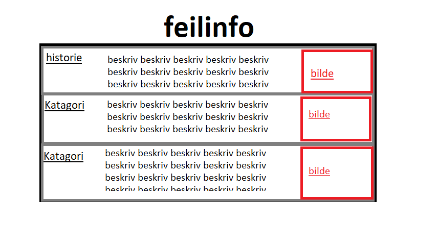
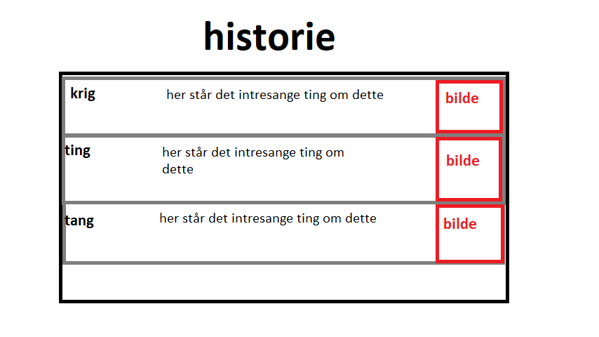
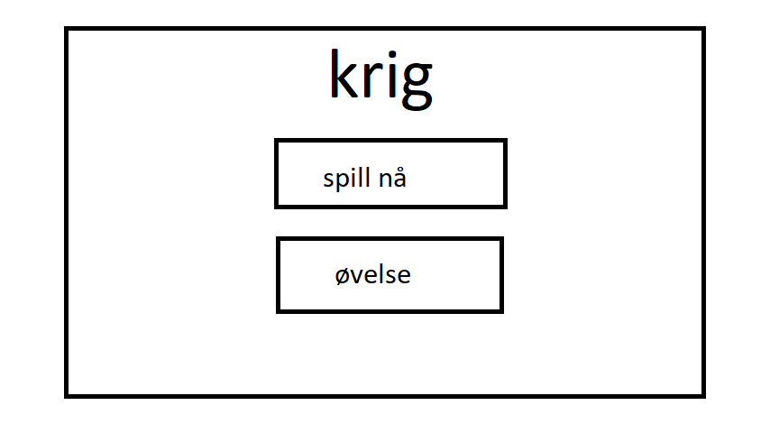
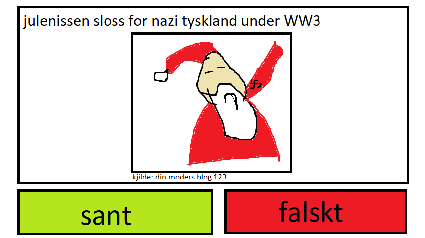
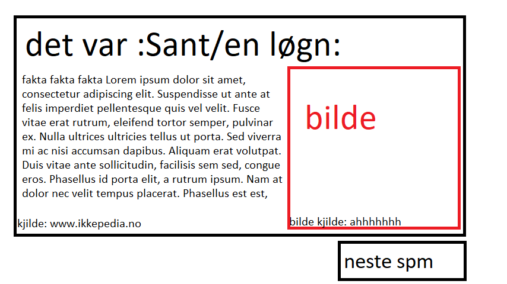

# feilinfo
## et spill om feilinformasjon
---
## Behovsanalyse

* krigspill?
* historie?

#### Hvilke utfordringer har brukeren?

* ingen utfordringer å ta til hånd for et slik spill

#### Hvilke interesser har brukeren?
Brukeren er veldig intresert i krig og historien bak land. Brukeren

* historie
* gografi
* krig

## Applikasjon

#### Hva er applikasjonen?

en app som spør spørsmål noen av dem er sanne og noen er løyn brueren skal velge om det er sant eller en løyn brukeren skal prøve å svare på så 10 tilfeldig trukket spørsmål på så kort tid som mulig.
1. appen åpner til en meny av katagorier (feks historie, land, engelsk etc) 
2. du kan deretter velge et tema inafor der (feks historie -> krig, utforsking, personer)
3. nå kommer opp en side hvor du kan velge mellom å øve eller spill
    * om du velger øve kommer vil den samle opp 10 spørsmål fra sql databasen og etter hvert spørsmål vil den komme med en forklaring.
    * om spilleren velger spill kommer så skaffer den seg 10 spørsmål og en timer og da er det om å gjøre å gjøre det så fort som mulig for å komme seg på leaderbordet

## Fremgangsmøte

### sql
#### katagorier
catagory
| cataid(int) | navn(varchar) |
|-|-|
| katogori iden | navnet til katagorien |
##### tema
theme
| cataid(int) | themenem(varchar) | qn(varchar) |
|-|-|-|
| catagori iden for å linke sammen temaene og katagorien | nanet til temat | linker til qn-___ tabellen |
#### spørsmål
qn-(3 bokstaver som beskriver (feks - flagg = flg))
| qnID(int) | qn(varchar) | img(varchar) | srcimg(varchar) |
|-|-|-|-|
| spørsmålets id | spørsmålet | bilde somtilhører spørsmålet | hvor bilde er tatt fra |
#### spørsmål svar
qn-ans-(3 bokstaver som beskriver (feks - flagg = flg))
| qnid(int) | fact(varchar) | srcfact(varchar) |
|-|-|-|
| linker sanneb qn-___ og denne tabelen | fakta for spørsmålet | hvor informasjonen er hentet fra |
---
#### leadertavle
lb-(3 bokstaver som beskriver (feks - flagg = flg))
| time(int) | name(varchar) |
|-|-|
| tid i sekunder | navnet til spilleren |
### node js

skal kun brukes til å hente data fra sql databasen og sende ut json filer

(all)hoveddelen av prosesering skal sje på brukerns maskin

---
### html css js
all frontend greier (bruker node js for backend for å hente spørsmål etc)

---
### bildesotering
bilder får en standard plasering og navn basert på hvor de hører til

img/qn-___/qnid.webp

97.17% av alle browsere suporter webp og er 26% mindre en png bilder 25-34% mindre en jpg. 

alle bilder skal være firkanta og max 512 pixler stor
## gjennomgang
### hovedside
her kan du velge hvilken type fag du vil drive med

### katgori velging
her kan du velge hvilken type katogorogi du vil drive med innafor faget

### spillsiden
her velger du typen spill du vil spille om du vil øve eller spille for poeng

### spørsmålet
her kan du se en teori også skal spilleren velge om den tror at det er sant eller falskt.

### sanheten
om du spiller øve vil du få fakta om spørsmålet etter du svarte
